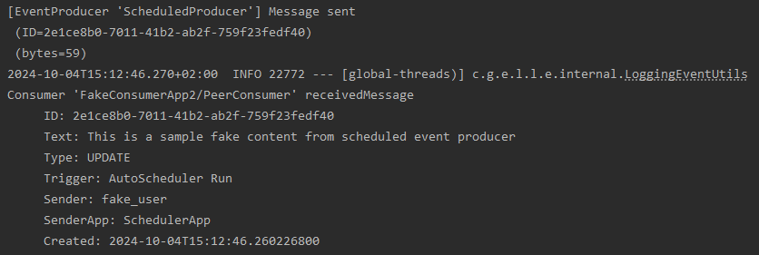

# How to use the application

RUN VIA DOCKER: 
In order to start the application just go to `/infrastructure` directory and run docker compose: 
```
> docker-compose up -d
```
Then, you should be able to access the SwaggerUI: <br>
http://localhost:8080/swagger-ui/index.html (credentials: `god`/`password`)


## Security 
> <span style='color:#fa0'>***TODO***</span>
> 
> Describe extra filter 'godmode' login 

## Validation
> <span style='color:#fa0'>***TODO***</span>
> 
> Describe validation cases 

## Eventing

### Setup & Run 
In order to test the eventing demo feature you need to setup the Docker AMQ container:
// TODO: Create and describe Docker run starting both - amq broker and application itself

### Eventing API
After application is started on localhost you can visit it's Swagger:
http://localhost:8080/swagger-ui/index.html#/Eventing%20methods

#### Endpoints
It enables to send an event in different modes: 
* `/api/v1/eventing/peer/send` - sends a message to a peer-to-peer queue, so it will be consumed by one of multiple consumers
* `/api/v1/eventing/pubsub/send` - sends a message to a publisher=subscribed topic, so it will be consumed by all consumers listening for topic messages
* `/api/v1/eventing/vtopic/send` - not supported yet... 

#### Request body: 
Each event should have a following JSON body:
```json
{
  "messageType": "CREATE_MESSAGE",
  "messageContent": "Message content",
  "messageId": "f2f05535-6372-4cf7-825e-7c0a2a43b6bf"
}
```

#### Logs: 
Each time a message is sent (no matter if peer or pubsub), logs will present this fact in the following, or similar, form: 


where the producer and consumer logs can be observed... 

### Scheduler
The Learning app has a scheduler which sends a Peer message in a specific time intervals. It can be configured in `application.properties`:
```propertiesn
### Scheduler
eventing.scheduled.producer.enabled=true
eventing.scheduled.producer.interval.ms=10000
```

### Retry / Redelivery
Unlike the old AMQ, Artemis configures the redelivery on the broker level (`broker.xml`).  It means, this cannot be configured in the code. 

Nevertheless, to check/trigger the default behavior you can send a poison message via API - this should trigger defualt redelivery

#### Poison message
To simulate a poison message - message which causes error while being proceeded - the `"Poison message"` should be entered as message content
```json
{
  "messageType": "CREATE_MESSAGE",
  "messageContent": "Poison message",
  "messageId": "f2f05535-6372-4cf7-825e-7c0a2a43b6bf"
}
```

