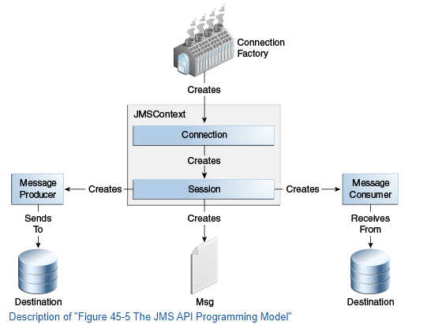
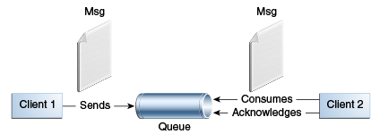
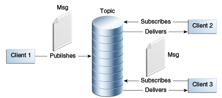
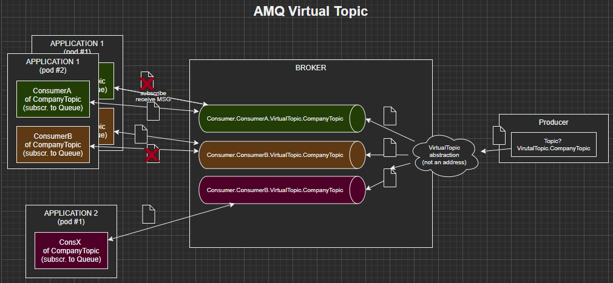

# Eventing - basic notes

> ***TODO***
> 
> Read: https://docs.oracle.com/javaee/7/tutorial/jms-concepts003.htm#BNCEH 

## Basics

### Basic JMS
JMS is just a standard. There are also different inplementations of this standard like `ActiveMQ`, `ActiveMQ 6.0 (Artemis)`, `RabbitMQ`...

#### Basic terms

 <i>See the image with terms</i> 

>  

What is a <code>JMSProvider</code>?

> It is just a message broker which implements the JMS standard (interface and communication between producers and consumers).
> Examples: ActiveMQ, Rabbit, IBM MQ...

What is a <code>JMSClient</code>?

> An application / service which acts as a **producer or consumer**

Where does the producer send events to?

> To a destination - a topic or a queue - depending on the model. 

What is the <code>JMSDestination</code>

> As mentioned above - a topic or queue. Consumers consumes messages from a destination. 
> It is an object in application represents a place for producers and consumers.

Who creates a <code>JMSDestination</code>

> JMSProvider

What are main two types of destinations?

> * Topics - for publisher/subscriber model
> * Queue - for point-to-point approach

What is <code>JMSConnectionFactory</code>?

> Object used by JMSClient to connect to JMSProvider (message broker)

What is <code>JMSConnection</code>

> Represents an open connection to a message broker. It is created by the JMSConnectionFactory

What is <code>JMSSession</code>

> Context (single-threaded) for producing and consuming messages where producers and consumers can be created, also messages can be created and tranastion management is taking place.

What is <code>JMSMessageProducer</code> and <code>JMSMessageConsumer</code>

> Created by JMSSession. Sends messages to a destination (topic or queue).

#### Communication models

What are the main models of communication?

> Source: https://docs.oracle.com/javaee/7/tutorial
> 

> 
Point-to-point

> 
> > 
> * This approach uses a queue to which consumer subscribe and producers produce. It is possible to have more that on consumer, but im such case, only one of them will receive the message
> * Each message --> one consumer
> * The receiver can fetch the message whether or not it was running when the client sent the message
> 

>
> 

> 
Published / Subscriber

>
> > 
> * Each message can have multiple consumers
> * A client that subscribes to a topic can consume only messages sent after the client has created a subscription, and the consumer must continue to be active in order for it to consume messages
> * So, using this apporach AMQ when a new consumer is created, creates a queue extra for this consumer which is bound to topic. Each time a producer sends a message, it is copied to all queues
> 

> 

> 
Virtual Topics (AMQ)

>
> > 
> * Mixes the topics concept with the Queue concept...
> * Each message is sent to VirtualTopic (not a phisical address on AMQ broker, but some kind of abstraction, recognized my naming convention __"VirtualTopic.*"__.)
> * Afterwards message is multiplied through all VirtualTopics-assigned Queues, where each queue `Consumer.ConsumerName.VirtualTopic.TopicName` is created for a specific consumer name
> * Consumers then, when subscribing, subscribe to a specific Queue with consumer name... Even if we have 3 pods, message is consumed only by one (its just a Queue)
> 

How do we use VirtualTopics? 

> We can for example be sure, that each application using same topic has unique consumer name, but each pod of the same application with have the same consumer name.
> By doing so, when message is sent to vTopic, it will be delivered to each application (each queue), but only one pod of each application will handle it.

#### Durability and Sharing

What is a durable subscription?

>  It makes sense when we talk about topic case in "Publisher-Subscriber" model of communication.
>  Normally (non-durable), when we create a consumer (a subscription) we: 
>   * Create a connection (with uniqueID)
>   * Create a session
>   * Specify a destination
>   * Start a connection
> 
> In this case broker will deliver messages to consumer as long as consumer is connected (connection is active)
>
> Durability means to receive also messages from time a subscriber/consumer was not active
> * There is an extra step when creating a consumer - `session.createDurableConsumer(uniqueID, consumerName)` and broker knows also that even this specific consumer is not connected (like connection is down), all messages should wait until it is connected and then deliver messages. 
> * When application closes, we should call session.unsubscribe(consumer) to unregister the subscription.

How is durable subscription identified on a broker?

> * Unique **ClientID** - id of a client (when connection is created... for example application-name-123)
> * Unique Subscription-/**ConsumerName** - uniquely identifies a consumer in the context of client/connection

What does it mean to create subscription and start a subscription? 

> Everything is created so connection, sessions, destination, consumer etc but `Connection` is not yet started. 
> When connection starts, consumer receives messages... 

Does `durableConsumer.close()` removes a durable subscription from broker?

> Nope. First we need to remove close all subscribers assigned to a durable subscription, and then separately `session.unsubscribe()` the durable subscription.
> 
> Actually, we can even create a connection, session and define a durable subscription / consumer with clientID and consumer/subs name (`session.createDurableSubscriber(topic, "myDurableSubscription")`) and then close everything, and durable subscription will be already on broker. All messages from specified topic would wait until our ClientID/SubscriptionName subscription will be active.  

#### Receiving a message

JMS support synchro receiving (what method?) but...?

> The `receive()` method waits for incoming messages but can block the thread/app, so timeout should be set

<code>MessageListener</code> vs <code>SessionAwareMessageListener</code>

> * Second gets also session from the message comes from...
> * Second throws `JMSException` outside

How do we call a message which cannot be process? 

> Poison message

What gives us a redelivery setup? 

> How many times a message should be redelivered before it's considered a poison message

#### Other

Main responsibilities of a broker

> * Routing and delivery
> * Persistence
> * Transactions
> * Security
> * Providing administrative/management tools and mechanisms

The role of a <code>MessageListener</code>

> When defining a consumer, wh can configure/set an implementation of a MessageListener, so the
> application listens for an incoming messages from the destination. The `onMessage()` method does the work.

Would ActiveMQ create a destination automatically?

> Yes, ActiveMQ can automatically create a queue when a client defines it, **provided that** 
> the broker is configured to allow dynamic destination creation.
> 
> By default, ActiveMQ is set up to create destinations (queues and topics) dynamically 
> when they are first referenced by a producer or consumer.

Syncho vs Asynchro consumption

> * Synchro - using `receive()` method blocking until a message comes or timeout is reached
> * Asynch - using a message listener for waiting to incoming messages

