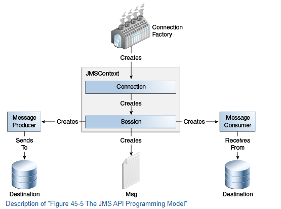
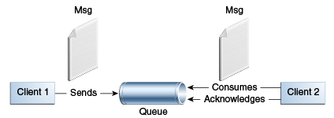
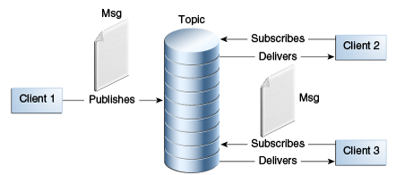

# Eventing - basic notes

> ***TODO***
> 
> Read: https://docs.oracle.com/javaee/7/tutorial/jms-concepts003.htm#BNCEH 

## Basics

### Basic JMS
JMS is just a standard. There are also different inplementations of this standard like `ActiveMQ`, `ActiveMQ 6.0 (Artemis)`, `RabbitMQ`...

#### Basic terms

 <i>See the image with terms</i> 

>  

What is a <code>JMSProvider</code>?

> It is just a message broker which implements the JMS standard (interface and communication between producers and consumers).
> Examples: ActiveMQ, Rabbit, IBM MQ...

What is a <code>JMSClient</code>?

> An application / service which acts as a **producer or consumer**

Where does the producer send events to?

> To a destination - a topic or a queue - depending on the model. 

What is the <code>JMSDestination</code>

> As mentioned above - a topic or queue. Consumers consumes messages from a destination. 
> It is an object in application represents a place for producers and consumers.

Who creates a <code>JMSDestination</code>

> JMSProvider

What are main two types of destinations?

> * Topics - for publisher/subscriber model
> * Queue - for point-to-point approach

What is <code>JMSConnectionFactory</code>?

> Object used by JMSClient to connect to JMSProvider (message broker)

What is <code>JMSConnection</code>

> Represents an open connection to a message broker. It is created by the JMSConnectionFactory

What is <code>JMSSession</code>

> Context (single-threaded) for producing and consuming messages where producers and consumers can be created, also messages can be created and tranastion management is taking place.

What is <code>JMSMessageProducer</code> and <code>JMSMessageConsumer</code>

> Created by JMSSession. Sends messages to a destination (topic or queue).

#### Communication models

What are the main models of communication?

> Source: https://docs.oracle.com/javaee/7/tutorial
> 

> 
Point-to-point

> 
> > 
> * Each message --> one consumer
> * The receiver can fetch the message whether or not it was running when the client sent the message
> 

>
> 

> 
Published / Subscriber

>
> > 
> * Each message can have multiple consumers
> * A client that subscribes to a topic can consume only messages sent after the client has created a subscription, and the consumer must continue to be active in order for it to consume messages
> 

What is a durable subscription?

> By default, in topic based model, subscriber can receive messages sent after it has subscribed itself to a topic.
>
> Durable subscription enables to get rid of this requirement, but it has to be configured first.

#### Other

Main responsibilities of a broker

> * Routing and delivery
> * Persistence
> * Transactions
> * Security
> * Providing administrative/management tools and mechanisms

The role of a <code>MessageListener</code>

> When defining a consumer, wh can configure/set an implementation of a MessageListener, so the
> application listens for an incoming messages from the destination. The `onMessage()` method does the work.

Would ActiveMQ create a destination automatically?

> Yes, ActiveMQ can automatically create a queue when a client defines it, **provided that** 
> the broker is configured to allow dynamic destination creation.
> 
> By default, ActiveMQ is set up to create destinations (queues and topics) dynamically 
> when they are first referenced by a producer or consumer.

Syncho vs Asynchro consumption

> * Synchro - using `receive()` method blocking until a message comes or timeout is reached
> * Asynch - using a message listener for waiting to incoming messages

