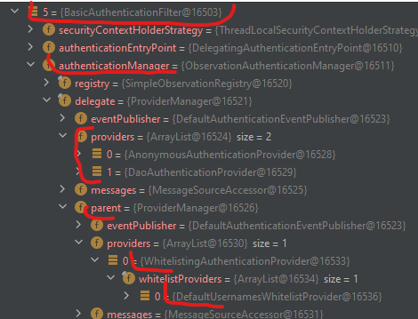

# Spring Security - basic notes
https://docs.spring.io/spring-security/reference/index.html

## Basic architecture overview
On the very high level, SpringSecurity uses the concept of Servlet's filters and is implemented inside it... <br>
Starting from the level where SpringSecurity is already "in touch" with core Servlet Filters mechanisms, 
the `SpringFiterChain`s come into play. We can define more than one - each can support different requests. 
Each filter contains filters (added based on configuration)

### Core Architecture
Screen from https://docs.spring.io/spring-security/reference/servlet/architecture.html


### Core components

* **Web / Servlet world**
  * `Filter` - interface implemented by pure Servlet Filters. Out of scope in this note page.
* **Spring's world**
  * `DelegatingFilterProxy` 
    * is a Spring class implementing web `Filter`. Bridge between Servlet lifecycle and Spring context
    * delegates job to a Spring Bean  (implementing web Filter) from Spring Context
    * makes also possible to init the Spring Beans later - after container initializes the Filters.
* **Spring Security world**
  * `FilterChainProxy` - A @Bean. Special filter from SpringSecurity allowing to delegate to other Spring Security filter via `SecurityFilterChain`
    * **nice place to start debug**
    * it has many SpringSecurity related responsibilities like clearing security context...
    * Can determine when `SecurityFilterChain` can be invoked (using RequestMacher, so not only by URL) - we can have more than one filter chain defined in our application
  * `SecurityFilterChain` - Used to determine which Spring Security filters should be involved in request
    * Many security filter chains can be defined in the application
    * Only first matching security filter chain is executed - order of chains is important
    * Each SecurityFilterChain defines an autonomous set of `SecurityFilters`
  * `SecurityFilter`
    * Inserted into `FilterChainProxy` via `SecurityFilterChain` API
    * SecurityFilter example: authentication, authorization, csrf, ...
    * Filters are invoked in specific order (for example authentication before authorization)


## In this project...

### Debug view

We have multiple security filter chains as on the following debug:

* `FilterChainProxy` has a collection of `SecurityFilterChain`s
* Each `SecurityFilterChain` has defined `securityMatchers`
* Each chain has its own `SecurityFilters` which are executed in some defined order

### Multi `SecurityFilterChain`s configuration

In the project there is an example of multiple `SecurityFilterChain` configurations with some ordering. 
Example of on filter chain:

```java
@Bean
@Order(100)
public SecurityFilterChain restApiSecurityConfiguration(HttpSecurity httpSecurity) throws Exception {
        return httpSecurity
            .securityMatcher(API_URL_PATTERN)
            .csrf(AbstractHttpConfigurer::disable)
            .authorizeHttpRequests(requests -> requests
                .requestMatchers(antMatcher(HttpMethod.DELETE, API_URL_PATTERN)).hasRole(ADMIN)
                .requestMatchers(antMatcher(API_URL_PATTERN)).hasAnyRole(ADMIN, USER)
                .anyRequest().authenticated()
            )
            .sessionManagement(session -> session.sessionCreationPolicy(STATELESS)) // <-- one sessions between requests
            .httpBasic(Customizer.withDefaults()) // <-- adds basic auth things
            .build(); 
        }
```

### Sample filters in a single `SecurityFilterChain` securing the REST API
```
0 = {DisableEncodeUrlFilter@17344} 
1 = {WebAsyncManagerIntegrationFilter@17345} 
2 = {SecurityContextHolderFilter@17346} 
3 = {HeaderWriterFilter@17347} 
4 = {LogoutFilter@17348} 
5 = {BasicAuthenticationFilter@17349} // <--- BASIC AUTH (filter -> provider -> parentProvider (DaoAuthProvider) -> userDetails
// 5a = {UsernamePasswordAuthenticationFilter} // <-- would come to play for form-based authentications 
6 = {RequestCacheAwareFilter@17350} 
7 = {SecurityContextHolderAwareRequestFilter@17351} 
8 = {AnonymousAuthenticationFilter@17352} 
9 = {SessionManagementFilter@17353} 
10 = {ExceptionTranslationFilter@17354}  // <--- TRANSLATES TO HTTP RESPONSES
11 = {AuthorizationFilter@17355} 
```
In case of Basic Authentication request, the `BasicAuthenticationFilter` does it's job.


## Authentication

### Authentication architecture
* `SecurityContextHolder` - holds info about authenticated person details
  * Holder uses local thread, but no worries - `FilterChainProxy` clears it after request is processed
  * Thread related things [can be customized](https://docs.spring.io/spring-security/reference/servlet/authentication/architecture.html#servlet-authentication-securitycontextholder)
* `SecurityContext` - taken from above and contains Authentication
* `Authentication` - currently authentication person (from SecurityContext) or input to AuthenticationProvider with person who wants to authenticate
  * contains **Principle** - it can be for example `UserDetails` in case of user/pass authentication
  * contains **Credentials** - usually a password; ofter cleared after succesfull authentication for security reasons
  * contains **Authorities** - a collections of `GrantedAuthority` instances
    * `GrantedAuthority` - privileges of authenticated person (roles, scopes)
      * Like `ROLE_ADMIN`
      * in case of user/pass authentication, `GrantedAuthority` objects are loaded by `UserDetailsService`  


### About `AuthenticationManager`, `ProviderManager` and `AuthenticationProvider`
```java
public interface AuthenticationManager {
  Authentication authenticate(Authentication authentication)
    throws AuthenticationException;
}
```

* `AuthenticationManager` is an abstraction/API/interface describing a common behaviour of authenticating
  * The outcome `Authentication` lands in `SecurityContextHolder`
  * The most common implementation is `ProviderManager`
  * `ProviderManager` --- <sup>(delegates)</sup> ---> `List<AuthenticationProvider>` 
    * `AuthenticationProvider`
      * Each `AuthenticationProvider` can return:
        * `Authentication` - accepted an Authentication to process further
        * `null` - cannot support an Authentication - try a next one...
        * throw Exception - reject an Authentication
      * Example of `AuthenticationProviders`: 
        * `DaoAuthenticationProvider` (implements)
          * uses `UserDetailsService`
            * InMemory
            * JDBC
          * uses `PasswordEncoder`
        * `JwtAuthenticationProvider` (implements)
        * ... 
    * If none of `List<AuthenticationProvider>` can support `Authentication`, the is `ProviderNotFoundException` thrown.
    * `ProviderManager` _may_ also have a parent invoked when no `AuthenticationProvider` can perform authentication
  
### Example of `DaoAuthenticationProvider`: 
https://docs.spring.io/spring-security/reference/servlet/authentication/passwords/dao-authentication-provider.html


### Creating custom AuthenticationProvider
* In order to create an extra authentication provider, just implement an interface.
* It can be done as lib with autoconfiguration
  * do forget about @ComponentScan to include autoconfigured stuff
* CustomAuthenticationProvide supporting UserPassAuthToken, overriden the default one configured by userDetailsService bean, that's why I had to add it manually to standard config (so the DaoAuthProvider was not overriden)

### Example of custom `AuthenticationProvider` in library: 

#### External lib: 
```java
@AutoConfiguration
@Slf4j
public class DefaultWhitelistingConfig {

    @Bean
    @ConditionalOnMissingBean(UsernamesWhitelistProvider.class) // <-- only when consumers do not define their own WL providers
    public UsernamesWhitelistProvider defaultUsernamesWhitelistProvider() {
        log.info("No whitelisting configured - adding default configuration...");
        return new DefaultUsernamesWhitelistProvider();
    }
}
```
##### spring.factories
```log
org.springframework.boot.autoconfigure.EnableAutoConfiguration=\
com.gitlab.emradbuba.learning.learningproject.libs.security.WhitelistingAuthenticationProvider,\
com.gitlab.emradbuba.learning.learningproject.libs.config.DefaultWhitelistingConfig
```

#### Consumer service: 
```java
    @Bean
    @Order(500)
    public SecurityFilterChain restApiSecurityConfiguration(HttpSecurity httpSecurity) throws Exception {
        return httpSecurity
                .securityMatcher(API_URL_PATTERN)
                .csrf(AbstractHttpConfigurer::disable)
                .authorizeHttpRequests(requests -> requests
                        .requestMatchers(antMatcher(HttpMethod.DELETE, API_URL_PATTERN)).hasAnyRole(ADMIN, DEFAULT_WHITELIST_ROLENAME)
                        .requestMatchers(antMatcher(API_URL_PATTERN)).hasAnyRole(ADMIN, USER)
                        .anyRequest().authenticated()
                )
                .userDetailsService(inMemoryUsersDetailsService) // <-- NOT THAT AUTOCONFG OVERRIDES DaoAuthProvider
                .sessionManagement(session -> session.sessionCreationPolicy(STATELESS))
                .httpBasic(Customizer.withDefaults())
                .build();
    }
}
```

#### ComponentScan
Dont forget about point packages where spring should look for configs
```java
@SpringBootApplication
@ComponentScan(basePackages = {"com.gitlab.emradbuba.learning.learningproject.*"}) // <-- 
public class LearningApplication {...}
```

#### Effects: 


## Authorization
https://docs.spring.io/spring-security/reference/servlet/authorization/architecture.html
https://docs.spring.io/spring-security/reference/servlet/authorization/authorize-http-requests.html
https://docs.spring.io/spring-security/reference/servlet/authorization/events.html

## Other things
Other Spring Security related topics...

### Custom filters
It is possible to [create custom filters](https://docs.spring.io/spring-security/reference/servlet/architecture.html#adding-custom-filter):
```java
@Bean
SecurityFilterChain filterChain(HttpSecurity http) throws Exception {
http
    // ...
    .addFilterBefore(new CustomFilter(), AuthorizationFilter.class);
return http.build();
}
```

## Follow up topics
> <span style='color:#fa0'>***Next topic to learn***</span>
> 
> * Authorization
> * Exploits
> * Other topics like JWT, OAuth, SAML