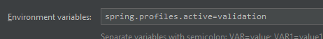

## About validation

--------
### Resources: 
* Official: 
  * https://docs.spring.io/spring-framework/reference/core/validation/beanvalidation.html
* Nice blog posts:
  * https://reflectoring.io/bean-validation-with-spring-boot/ - really nice :) 
  * https://reflectoring.io/bean-validation-anti-patterns/#anti-pattern-1-validating-only-in-the-persistence-layer
--------

***Note:*** _In code, this part is more 'demo-orineted' so is having a separate package. App should be started with profile "validation", to load ControllerAdvice only in this case..._


--------

### Basic info
<details>
<summary>Jakarta Standard and implementations</summary>

> * Jakarta Bean Validation 3.0 is a standard described as `JSR-380`
> * The only certified implementation for now is `HibernateValidator`
</details>

<details>
<summary>What does standard provides?</summary>

Among other things, it ensures that the properties of a bean meet specific criteria, using annotations such as @NotNull, @Min, and @Max.
</details>

<details>
<summary>How <code>HibernateValidator</code> implementation is connected to Hibernate framework...</summary>

hibernate-validator is entirely separate from the persistence aspects of Hibernate. So by adding it as a dependency, we’re not adding these persistence aspects into the project.
</details>

### Sample usage: 
```
@NotNull
private String firstName;

private <@NonBlank String> addresses;

public Optional<@Past LocalDate> getDateOfBirth() {
    return Optional.of(dateOfBirth);
}
```

### When validation takes place? 
<details>
<summary>Approach 1 - the more common and 'hidden'</summary>

> * When just appropriate annotations are used (in Spring, adding a `@Valid` annotation would be an example)
</details>

<details>
<summary>Approach 2</summary>

> * Programmatically, with creating a validator instance and running it for specific object to validate...
> ```
> ValidatorFactory factory = Validation.buildDefaultValidatorFactory(); 
> Validator validator = factory.getValidator();
> Set<ConstraintViolation<User>> violations = validator.validate(user);
> ```
</details>

### Differences between `@Valid` and `@Validated` annotations?
<details>
<summary><code>@Valid</code> - the meaning</summary>

> The `@Valid` used to say that RequestBody has to be validated

</details>

<details>
<summary><code>@Validated</code> - the 1<sup>st</sup> meaning (method level)</summary>

> The `@Validated` annotation is suitable when we have some groups of validations. 
> See the [article](https://www.baeldung.com/spring-valid-vs-validated) for more info.
</details>

<details>
<summary><code>@Validated</code> - the 2<sup>nd</sup> meaning (class level)</summary>

> In case of pathVariables and requestParams... 
> The `@Validated` annotation is a class-level annotation that we can use to tell Spring to 
> validate parameters that are passed into a method of the annotated class
</details>
<br>

<details>
<summary>Is <code>@Valid</code> transitive?</summary>

> If a class contains a field with another complex type that should be validated, this field, too, needs to be annotated with `@Valid` annotation.
</details>

<details>
<summary>Exceptions thrown by RequestBody and request params validations</summary>

> In contrast to request body validation a failed validation will trigger a `ConstraintViolationException` instead of a `MethodArgumentNotValidException`. 
> Spring does not register a default exception handler for this exception, so it will by default cause a response with HTTP status `500 (Internal Server Error)`.
</details>

### Creating custom Constraints: 
```java
@Target({ElementType.TYPE_USE})
@Retention(RetentionPolicy.RUNTIME)
@Constraint(validatedBy = CreditCardValidator.class)
public @interface ValidCreditCard {
    //...
}
```
```java
public class CreditCardValidator implements ConstraintValidator<ValidCreditCard, CreditCardDto> {
    //...
}
```

### Validation on <code>@Entity</code> claees:
The layer of entities is the last place where we can perform validation but it is not a perfect place.

<details>
<summary>Why not a perfect place?</summary>

> Validation on this level would mean that business logic (higher levels of application) could have worked with incorrect
> or incomplete data/information/objects... Hard to predict the side-effect of such fact...
</details>

<details>
<summary>Is Bean Validation supported for <code>Entities</code> by default?</summary>

> Yes. With same, JSR standard, annotations. That's why:
> * Validation in the sense of JSR specification is also supported by Hibernate itself.
> * Hibernate is by default used in Spring/Boot as default JPA implementation...
> * Hibernate supports Bean Validation out of the box
</details>

By the way - is it possible to turn off the validation on the persistnace level? 
<details>
<summary>Answer...</summary>

> Yes. If for any reason we want to disable Bean Validation in our Spring Data repositories, 
> we can set the Spring Boot property `spring.jpa.properties.javax.persistence.validation.mode to none.`
</details>

## Example

```java
@Setter
@Getter
@NoArgsConstructor
public class PostCreateNewWalletDto {

    @NotBlank(message = "Wallet name cannot be blank")
    @Length(max = 20, message = "Wallet name cannot be longer than 20 characters")
    private String walletName;

    @Email // <-- optional, @Email accepts null value
    private String walletNotificationEmail;

    @UUID(message = "Wallet UUID number has to be a valid UUID formatted string")
    private String uuidNumber;

    // CreditCardInfo
    @NotEmpty // <-- in this case, not empty collection
    private List<@ValidCreditCard CreditCardDto> creditCards;

    // DrivingLicenseInfo
    @Valid // <-- propagation required
    private DrivingLicenseDto drivingLicenseDto;
}
```

```java
@PostMapping("/{contextId}/create")
public ResponseEntity<CreateWalletResponseDto> createNewWallet(
        @UUID @PathVariable("contextId") String contextId,
        @Valid @RequestBody PostCreateNewWalletDto postCreateNewWalletDto) {
            // implementation of the controller ommited...
        }
```

**Notes**
* `@Valid` on internal/nested DTOs are required to propagate validation there,
* `@Validated` in controller, causes the `contextId` path variable is validated
* `@ValidCreditCard` annotation worked with no `@Valid` propagation...

##### Sample response: 
```
Validation failed for field 'walletName' | Reason: Wallet name cannot be longer than 20 characters
Validation failed for field 'creditCards[1]' | Reason: Credit card number not accepted. Accepted format: 0000-0000-0000-0000
Validation failed for field 'creditCards[2]' | Reason: Credit card limit not accepted. Minimum limit: 1000
Validation failed for field 'drivingLicenseDto.category' | Reason: Driving license category should be one character: 'A', 'B' or 'C'
Validation failed for field 'uuidNumber' | Reason: Wallet UUID number has to be a valid UUID formatted string
Validation failed for field 'drivingLicenseDto.creationDate' | Reason: must be a past date
Validation failed for field 'creditCards[0]' | Reason: Credit card type VISAx not accepted. Accepted type: VISA, MASTERCARD, MAESTRO
```


